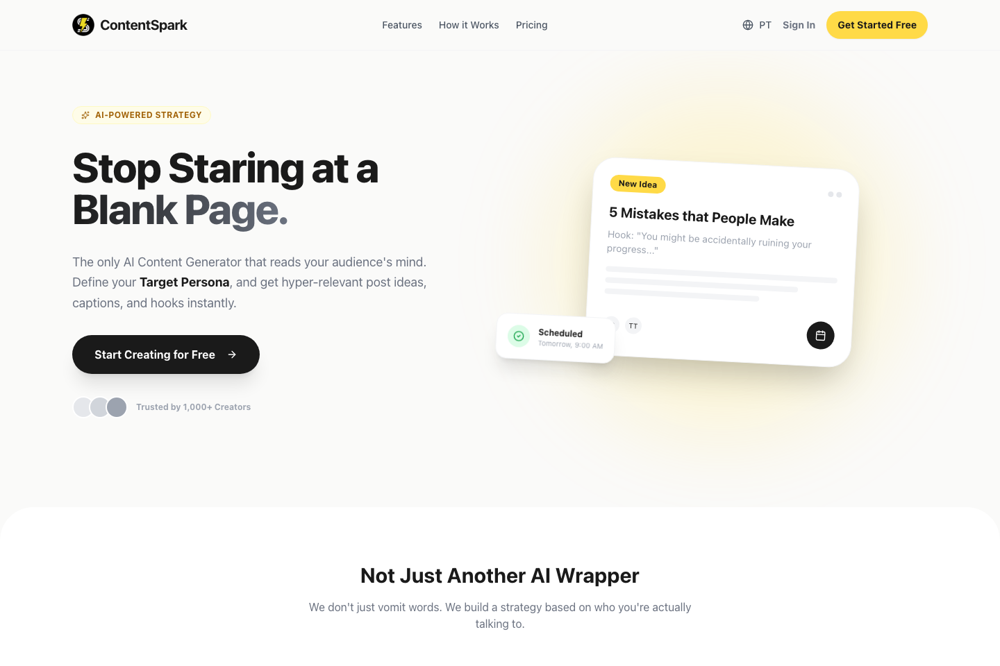
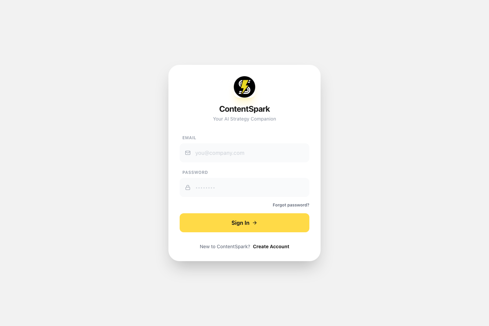
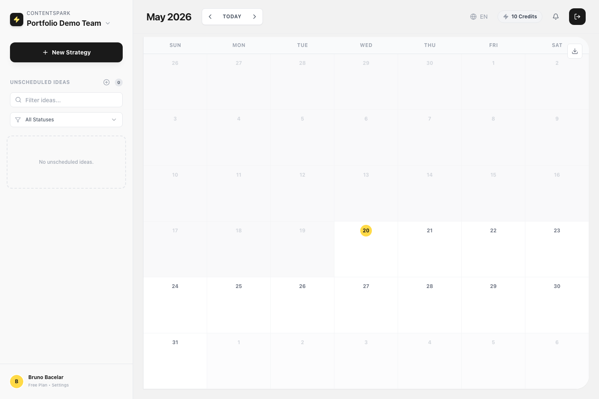
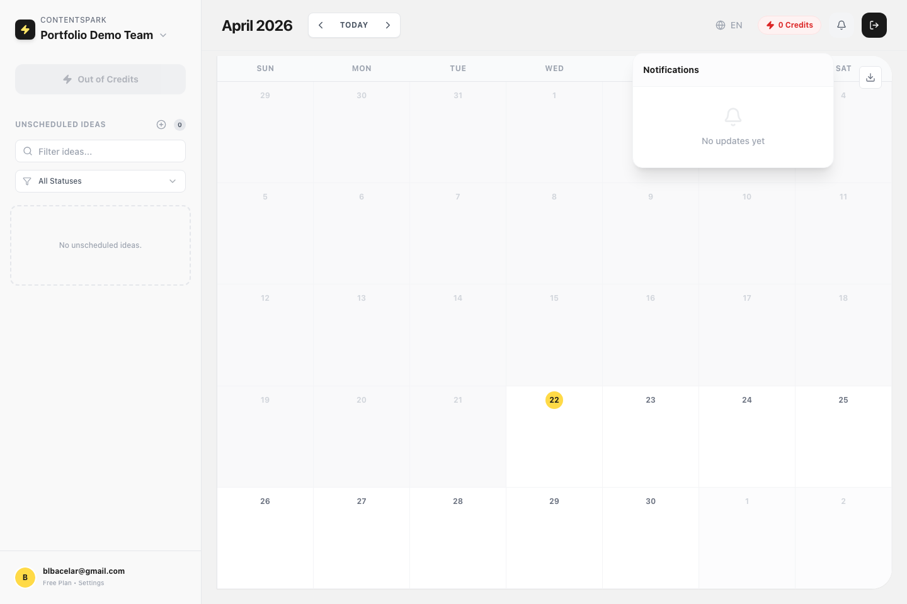
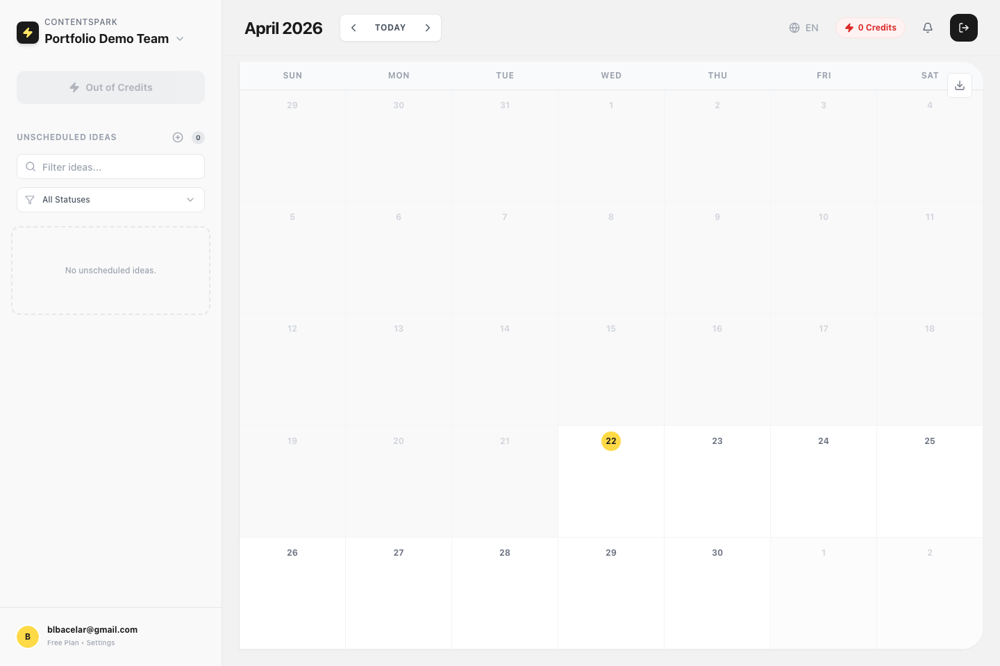
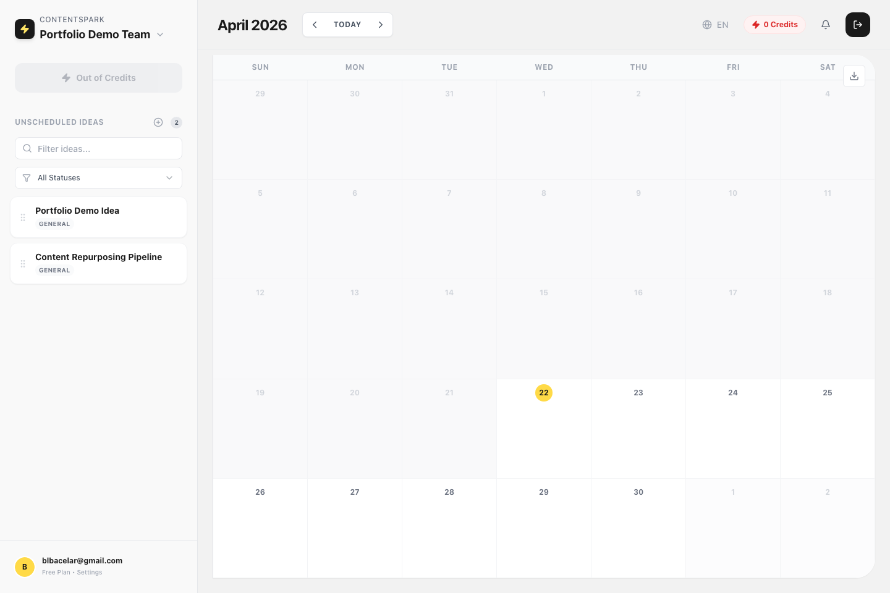
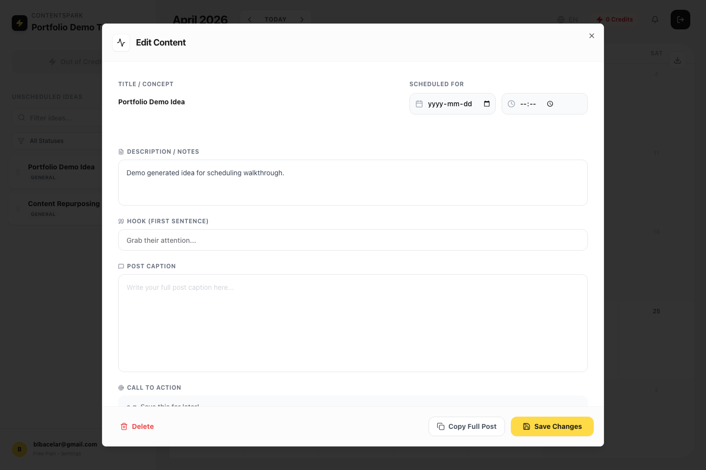
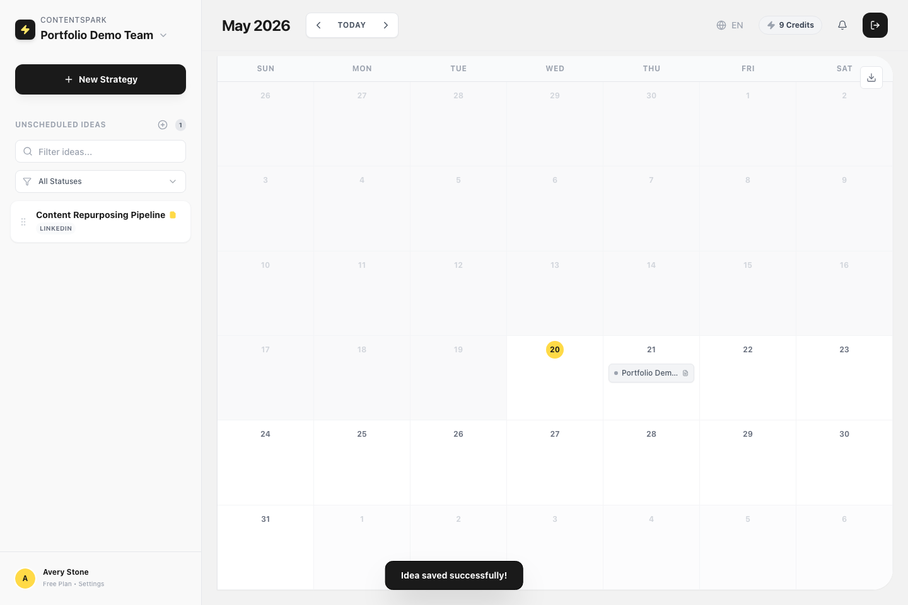

# ContentSpark Demo Walkthrough

This folder contains the portfolio demo assets for ContentSpark: a recorded product walkthrough and an ordered screenshot sequence covering the main user flow from public entry to scheduled content.

## Demo Video

- Recorded walkthrough: [contentspark-portfolio-demo.webm](./contentspark-portfolio-demo.webm)

## Screenshot Storyboard

### 1. Public entry

The demo starts on the marketing landing page before moving into the authentication entry point.

### 2. Authenticated workspace

After authentication, the walkthrough moves into the main dashboard and surfaces the in-app notifications experience.

### 3. Strategy and planning setup

The flow then shows the strategy entry point and the profile area where persona and brand context are managed. In environments where the Strategy Engine CTA is unavailable during the recording run, the fallback screenshot keeps the storyboard complete.

### 4. Idea generation and editing

Next, the walkthrough demonstrates the generated content backlog and the edit modal used to refine a piece of content before scheduling.

### 5. Calendar scheduling outcome

The walkthrough ends with a scheduled idea placed into the calendar, showing the planning workflow outcome.

