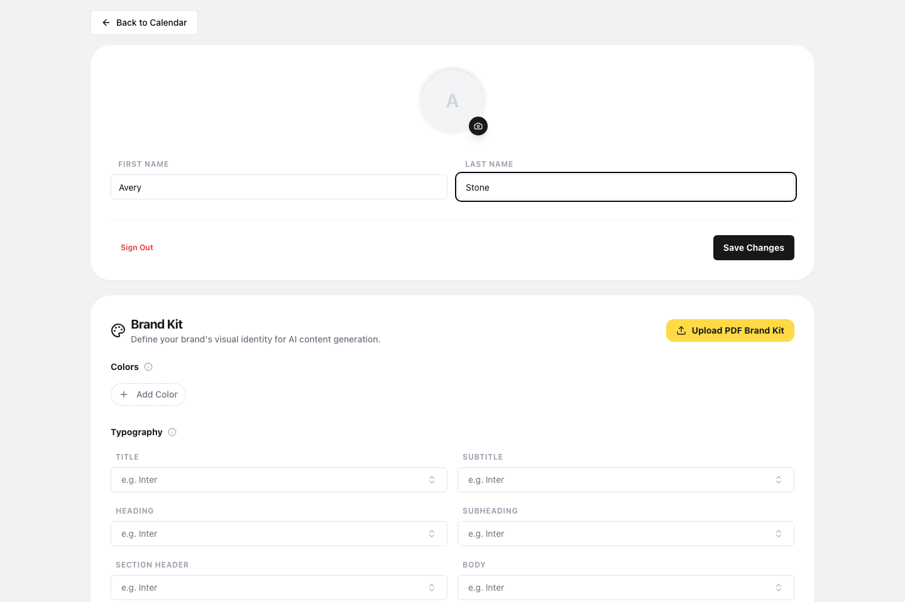
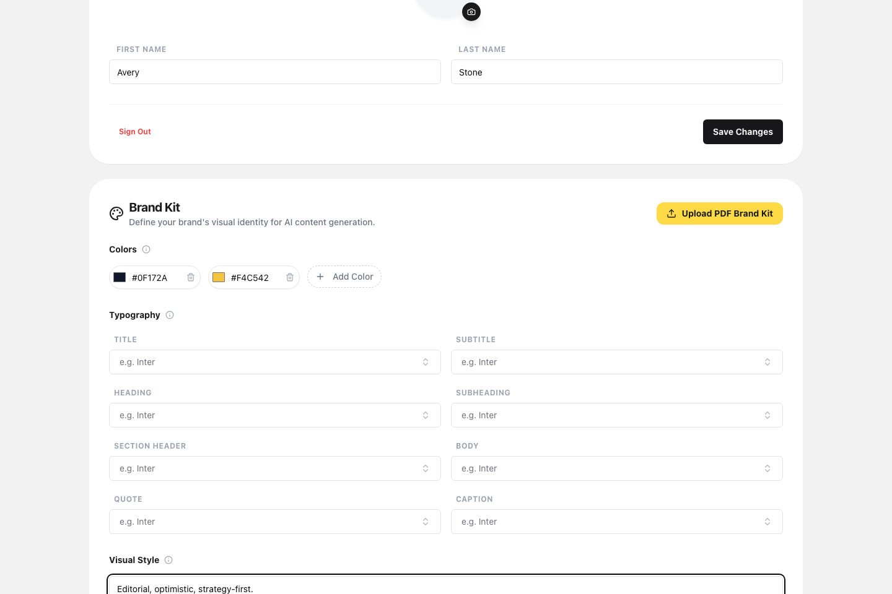
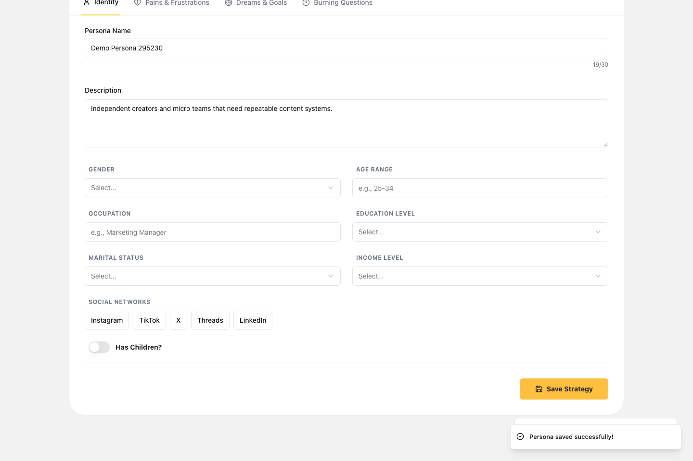

# ContentSpark Demo Walkthrough

This folder contains the portfolio demo assets for ContentSpark: a recorded product walkthrough and an ordered screenshot sequence covering the main flow from public entry through profile setup, brand context, persona creation, idea generation, and calendar scheduling.

## Demo Video

The recorded walkthrough covers the complete portfolio flow: profile creation, brand kit setup, persona creation, idea generation, and moving ideas into the calendar.

- Watch or download the full demo video: [contentspark-portfolio-demo.webm](./contentspark-portfolio-demo.webm)
- The video corresponds to the storyboard sequence documented below.

## Screenshot Storyboard

### 1. Public entry

The demo starts on the marketing landing page before moving into the authentication entry point.

### 2. Authenticated workspace

After authentication, the walkthrough moves into the main dashboard before the user starts configuring their workspace.

### 3. Profile and brand setup

The demo then creates the user profile details and adds a brand kit so later content generation has clear identity context.

### 4. Persona and strategy context

Next, the walkthrough creates a persona strategy so generated ideas reflect a concrete audience.

### 5. Idea generation and editing

With the profile, brand kit, and persona in place, the walkthrough generates ideas and opens the edit modal used to refine a piece of content before scheduling.

### 6. Calendar scheduling outcome

The walkthrough ends with a scheduled idea placed into the calendar, showing the planning workflow outcome.

